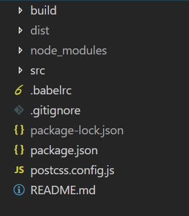

# webpack v4 相关配置

[最好的学习是看官方文档](https://webpack.docschina.org/concepts/)

## 我的项目结构

### 1、关于mode

选项                  | 描述
--------------------- | -----------------------
`development`         | 会将 `process.env.NODE_ENV` 的值设为 `development`。启用 `NamedChunksPlugin` 和 `NamedModulesPlugin`。
`production`          | 会将 `process.env.NODE_ENV` 的值设为 `production`。启用 `FlagDependencyUsagePlugin`, `FlagIncludedChunksPlugin`, `ModuleConcatenationPlugin`, `NoEmitOnErrorsPlugin`, `OccurrenceOrderPlugin`, `SideEffectsFlagPlugin` 和 `UglifyJsPlugin`.

### 2、关于开发服务器及热更新

>启动开发服务器

+ 通过webpack-dev-server命令行的方式
+ 通过Node.js API的方式

>开启热更新

+ 此demo是以命令行的形式添加--hot的方式开启热更新，以这种方式会自动添加webpack.HotModuleReplacementPlugin插件，而不需要额外配置。

### 3、关于[postcss](https://github.com/postcss/postcss)

postcss对于处理css真的很强大

### 4、关于context上下文

默认取当前项目目录，即 `E:\XQ\github\demo\webpack\webpack-demo\`，而不是webpack配置文件所在的目录`build`，这点要注意。

## 遇到的问题

### 1、无法在配置文件获取到process.env.NODE_ENV的值

许多`library`将通过与`process.env.NODE_ENV`环境变量关联，以决定`library`中应该引用哪些内容。我们可以使用 webpack 内置的 DefinePlugin 为所有的依赖定义这个变量:

~~~ js
new webpack.DefinePlugin({
    'process.env.NODE_ENV': JSON.stringify('production')
})
~~~

> 注意：在webpack 4中，设置了mode之后，构建工具会自动帮我们设置`process.env.NODE_ENV`

技术上讲，`NODE_ENV`是一个由`Node.js`暴露给执行脚本的系统环境变量。通常用于决定在开发环境与生产环境(dev-vs-prod)下，服务器工具、构建脚本和客户端 library 的行为。然而，与预期不同的是，无法在构建脚本`webpack.config.js`中，将`process.env.NODE_ENV`设置为 `"production"`，请查看[#2537](https://github.com/webpack/webpack/issues/2537)。因此，例如 `'process.env.NODE_ENV === 'production' ? '[name].[hash].bundle.js' : '[name].bundle.js'`这样的条件语句，在`webpack`配置文件中，无法按照预期运行。

综上所述，在webpack构建文件上，我们是无法获取得到process.env.NODE_ENV的值，即production或development，但在我们的本地代码文件，是可以获取得到这个值的。

解决方案：通过获取命令行的参数(`--mode=production`)，区分开发环境和生产环境，`process.argv` 可以获取命令行参数数组。

~~~ js
// 在package.json的scripts节点下添加
"build": "webpack --mode=production --config ./build/webpack.prod.conf.js --color --progress"
// 在构建文件获取
const isProduction = process.argv.indexOf('--mode=production') > -1;
~~~

### 2、`clean-webpack-plugin`插件无法清除文件问题

我的配置文件是在build目录下，而不是在根目录下，而插件的清除规则是只能清除插件根目录下的指定文件。
默认情况下，插件的根目录是在build目录下，而dist和build是兄弟目录，所以需要先指定插件的根目录为项目根目录，配置如下：

~~~js
new CleanWebpackPlugin('dist', {
    root: path.join(__dirname, '../')
})
~~~

### 3、`extract-text-webpack-plugin`提取公共文件问题

在官方配置中有一句警告：
>警告: ExtractTextPlugin 对 每个入口 chunk 都生成一个对应的文件，所以当你配置多个入口 chunk 的时候，你必须使用 [name], [id] 或 [contenthash]

由于此demo是多入口文件配置，而我在配置此插件的时候，文件名写死了styles.css，导致后入口提取的css文件覆盖了前入口提取的css文件，花了一个晚上在找bug，还是找不到问题所在。以为是插件提取css模块的问题，最后继续细读插件文档，得以找到问题所在。

### 4、`css-loader`的压缩选项`minimize`已移除

可以使用以下方案：

+ use postcss-loader with cssnano
+ use optimize-cssnano-plugin
